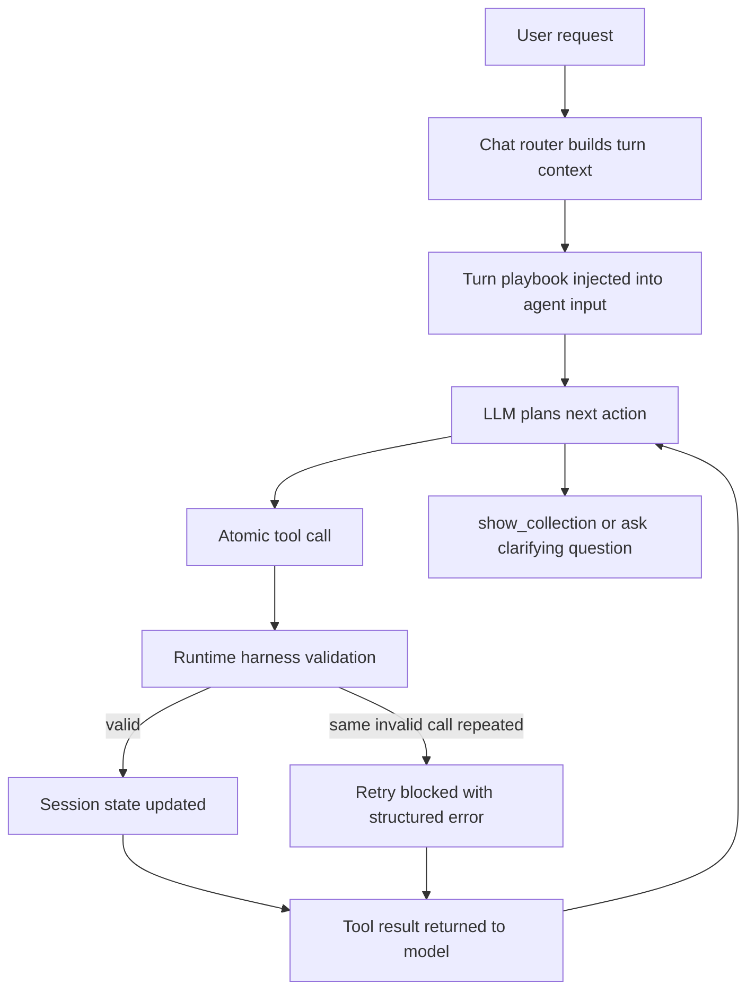

# Agent Runtime Harness

This document explains the stable retrieval architecture now used by the `aimoda` chat agent.

## Why this exists

The retrieval agent is meant to behave like a human shopping assistant:

- keep atomic tools small and predictable
- dynamically adjust filters based on the user's goal
- avoid getting trapped in repeated invalid tool calls

The main failure mode before this harness was:

1. the model understood a garment attribute such as `collar`
2. the tool required a bound `category`
3. the model retried the same invalid `add_filter(...)` call
4. the session never converged to `show_collection()`

So the core problem was not only prompt quality. It was missing runtime guardrails between the model and the tools.

## Layered architecture

The current design keeps atomic tools, but adds a thin decision layer around them.

1. Core system prompt
   - stable global rules
   - defines tool roles
   - forbids repeating failed calls

2. Turn playbook
   - injected per user turn
   - describes the active retrieval protocol
   - carries turn-only hints such as inferred category or image usage

3. Runtime harness
   - stores turn context
   - infers a single active category when the turn/session strongly implies one
   - blocks repeated invalid filter calls

4. Atomic tools
   - `start_collection`
   - `add_filter`
   - `remove_filter`
   - `show_collection`
   - `fashion_vision`

## Execution flow



## Key rules

- Only one state-changing tool should run per reasoning step.
- Garment attributes must bind to a garment category.
- If the turn or the session implies exactly one category, the harness may auto-bind it.
- If a tool says `retry_same_call=false`, the model must change strategy.
- Repeating the same invalid filter request is treated as a runtime failure, not as normal exploration.

## What changed in code

- `backend/app/agent/playbooks.py`
  - strengthened the core system prompt
- `backend/app/agent/harness.py`
  - added turn protocol generation
  - added invalid filter retry tracking
  - added category inference helpers
- `backend/app/agent/tools.py`
  - added harness-aware category auto-binding
  - added repeated-invalid-call blocking
  - returns structured JSON errors for the model to repair against
- `backend/app/agent/sse.py`
  - now also streams tool runtime errors to the frontend

## A/B expectation

Example request: `我想要找蓝色的娃娃领连衣裙`

- Without harness:
  - model may call `add_filter("collar", "peter pan collar")`
  - tool rejects because `category` is missing
  - model may loop

- With harness:
  - turn context infers `dress`
  - the same call is auto-bound to `category="dress"`
  - the retrieval flow keeps moving

## Validation commands

```bash
JWT_SECRET=testsecret QDRANT_API_KEY=foo LLM_API_KEY=bar PYTHONPATH=$(pwd) python3.11 -m unittest backend.tests.test_harness_runtime
JWT_SECRET=testsecret QDRANT_API_KEY=foo LLM_API_KEY=bar PYTHONPATH=$(pwd) python3.11 -m pytest backend/tests/test_harness_retrieval.py -q
JWT_SECRET=testsecret QDRANT_API_KEY=foo LLM_API_KEY=bar PYTHONPATH=$(pwd) python3.11 backend/scripts/harness_ab_test.py
```

## Future direction

The stable long-term direction is:

- keep tools atomic
- keep prompts smaller
- move more recovery policy into the runtime harness
- treat skill-like playbooks as on-demand protocol overlays instead of giant permanent prompts
